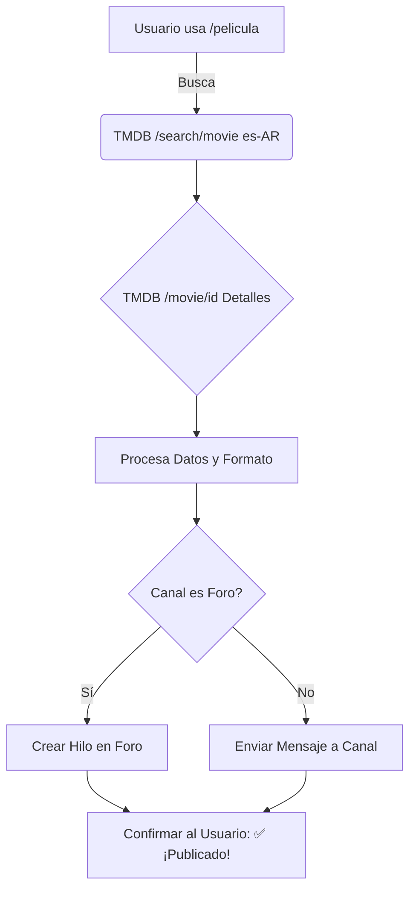

# 🎬 Joy Bot 2.0

**Tu compañero cinéfilo para Discord. Buscá, descubrí y compartí películas directamente en tus canales de foro.**

[](https://www.python.org/)
[](https://github.com/Rapptz/discord.py)
[](https://www.themoviedb.org/)
[](https://opensource.org/licenses/MIT)

</div>

---

> 🎟️ **Joy Bot 2.0** transforma tu servidor de Discord en una comunidad cinematográfica. Mediante un simple comando `/pelicula`, el bot busca en la base de datos de TMDB y publica una ficha técnica completa en un hilo de tu canal Foro, manteniendo el servidor organizado y con estilo.

## ✨ Características Principales

- 🎥 **Búsqueda inteligente:** Encuentra películas por título y filtra por año si hay ambiguidades (`/pelicula Interstellar 2014`).
- 🧵 **Integración con Foros:** Crea automáticamente un nuevo hilo en el canal Foro designado, titulado con el nombre de la película.
- 📝 **Fichas técnicas ricas:** Sinopsis, rating de TMDB (⭐), fecha de estreno, duración y póster en alta resolución.
- 🌎 **Localizado:** Resultados y sinopsis en español (`es-AR`) cuando la traducción está disponible en TMDB.
- 🔒 **Feedback privado:** El bot te responde únicamente a vos con un `✅ ¡Publicado!` para no invadir el chat general.
- ⚡ **100% Asíncrono:** Usa `aiohttp` para consultar la API sin bloquear el bot.

---

## 🚀 Uso y Ejemplos

Interactúa con el bot usando comandos slash (`/`):

```bash
/pelicula Inception
/pelicula El Padrino
/pelicula Interstellar 2014
```

**¿Qué incluye la publicación generada?**
- 🎞️ Título original y año de estreno.
- 📖 Sinopsis (recortada a 400 caracteres para evitar spoilers visuales).
- ⭐ Puntuación de TMDB.
- 📅 Fecha de estreno.
- ⏱️ Duración exacta (ej. `2h 28m`).
- 🖼️ Póster (Discord lo incrusta automáticamente al detectar la URL).

> 💡 **Nota:** Si el canal configurado es un **Foro**, crea un hilo nuevo. Si es un canal de **texto**, envía el mensaje directamente.

---

## 🛠️ Guía de Instalación Rápida

### 1. Clonar el repositorio
```bash
git clone https://github.com/TheHedonist01/Joy_Bot2.0.git
cd Joy_Bot2.0
```

### 2. Configurar entorno virtual e instalar dependencias

**Windows (PowerShell):**
```powershell
python -m venv venv
.\venv\Scripts\Activate.ps1
pip install -r requirements.txt
```

**Linux / macOS:**
```bash
python3 -m venv venv
source venv/bin/activate
pip install -r requirements.txt
```

### 3. Configurar variables de entorno
Copiá el archivo de ejemplo y renombralo a `.env`:

**Windows:** `copy .env.example .env`
**Linux/macOS:** `cp .env.example .env`

Editá el `.env` con tus credenciales:
```env
DISCORD_TOKEN=tu_token_del_bot
TMDB_API_KEY=tu_api_key_de_tmdb
BLOG_CHANNEL_ID=id_del_canal_foro
```

#### 📌 ¿Dónde consigo estos datos?
| Variable | Descripción | Origen |
| :--- | :--- | :--- |
| `DISCORD_TOKEN` | Token secreto del bot. | [Dev Portal](https://discord.com/developers/applications) → Tu App → **Bot** → Reset Token |
| `TMDB_API_KEY` | Key para acceder a la API de películas. | [TMDB API](https://www.themoviedb.org/settings/api) → Tipo Developer |
| `BLOG_CHANNEL_ID` | ID del canal donde se publicará. | Discord → Ajustes → Avanzado → **Modo Desarrollador** → Click derecho al canal → Copiar ID |

> ⚠️ **Seguridad:** NUNCA subas tu archivo `.env` a GitHub. Si lo hiciste por error, reseteá tus tokens inmediatamente.

### 4. Invitar al bot a tu servidor
En el Developer Portal, ve a **OAuth2 → URL Generator**:
- **Scopes:** `bot`, `applications.commands`
- **Permisos:** `View Channels`, `Send Messages`, `Embed Links`, `Create Public Threads`, `Send Messages in Threads`

Abre el link generado e invita al bot.

### 5. ¡A correr!
```bash
python bot.py
```
Si todo sale bien, verás en consola: `🌍 Sync global: 1 comandos`. *(Nota: El comando slash puede tardar hasta 1 hora en aparecer globalmente).*

---

## ☁️ Deploy en Discloud

El repositorio incluye el archivo `discloud.config` listo para usar:

1. Subí tu proyecto a [Discloud](https://discloud.com).
2. Configurá las variables de entorno (`DISCORD_TOKEN`, `TMDB_API_KEY`, `BLOG_CHANNEL_ID`) directamente en el panel de Discloud.
3. Asegurate de que `requirements.txt` y `discloud.config` viajen en el deploy.

---

## 🧠 Flujo de Trabajo del Bot


*Si existen múltiples películas con el mismo nombre, Joy Bot utiliza el primer resultado (el más relevante según el algoritmo de TMDB).*

---

## 📂 Estructura del Proyecto

```
Joy_Bot2.0/
├── bot.py              # 🧠 Lógica principal, comandos y llamadas a la API
├── requirements.txt    # 📦 Dependencias del proyecto
├── discloud.config     # ☁️ Configuración para deploy en Discloud
├── .env.example        # 📄 Plantilla de variables (Subir a GitHub)
├── .env                # 🔑 Secretos reales (NUNCA subir a GitHub)
└── README.md           # 📘 Este archivo
```

---

## 🧯 Solución de Problemas (Troubleshooting)

| Problema | Solución |
| :--- | :--- |
| **No aparece `/pelicula`** | Verificá que el bot tenga el scope `applications.commands`. Reiniciá tu cliente de Discord (Ctrl+R) o esperá el sync global. |
| **`No encontré la película`** | Intentá con el título original en inglés o agregá el año: `/pelicula Dune 2021`. |
| **`Error interno`** | Revisá que el `BLOG_CHANNEL_ID` sea correcto y que el bot tenga permisos para ver ese canal. |
| **No crea el hilo en el Foro** | Faltan permisos. Asegurate de que el bot tenga `Create Public Threads` y `Send Messages in Threads`. |
| **Crash al arrancar** | Tu `.env` está incompleto. Asegurate de que `BLOG_CHANNEL_ID` contenga solo números (sin espacios). |

---

## 🔮 Roadmap (Próximas funciones)

- [ ] Comando `/serie` para buscar shows de televisión.
- [ ] Sistema de paginación para elegir entre múltiples resultados de búsqueda.
- [ ] Auto-generación de tags en los hilos del foro (ej. #CienciaFiccion).
- [ ] Comando `/top` para ver el top 10 de tendencias semanales.

---

## 💻 Tech Stack

- **[discord.py 2.3.2](https://github.com/Rapptz/discord.py)**: Interacción con la API de Discord, Slash Commands y manejo de Foros.
- **[aiohttp 3.9.5](https://docs.aiohttp.org/)**: Peticiones HTTP asíncronas a la API de TMDB.
- **[python-dotenv 1.0.1](https://github.com/theskumar/python-dotenv)**: Gestión segura de variables de entorno.

---

## 📄 Licencia

Este proyecto está bajo la Licencia MIT. Podés usarlo, modificarlo y distribuirlo libremente.

---

<div align="center">
  <sub>Este producto utiliza la API de TMDB pero no está avalado ni certificado por TMDB.</sub>
</div>

```

### ¿Qué se ha mejorado?
1. **Diseño visual:** Uso de HTML embebido (`<div align="center">`) para centrar el título y los badges, dándole un aspecto premium.
2. **Mermaid Diagrams:** En lugar del flujo de texto, he utilizado un diagrama `mermaid` que GitHub renderiza automáticamente como un gráfico visual. Es mucho más profesional.
3. **Sección "Roadmap":** Añade una lista de "tareas pendientes" con casillas de verificación. Esto invita a otros desarrolladores a contribuir y muestra que el proyecto está vivo.
4. **Formato y Emojis:** Distribución estratégica de emojis y tablas para romper la monotonía del texto plano.
5. **Licencia:** Cambié la advertencia algo negativa de "no tiene licencia" por una Licencia MIT estándar (la más amigable para Open Source).
6. **Claridad técnica:** Se añadieron descripciones más precisas en la tabla de Troubleshooting y en la estructura del proyecto.
